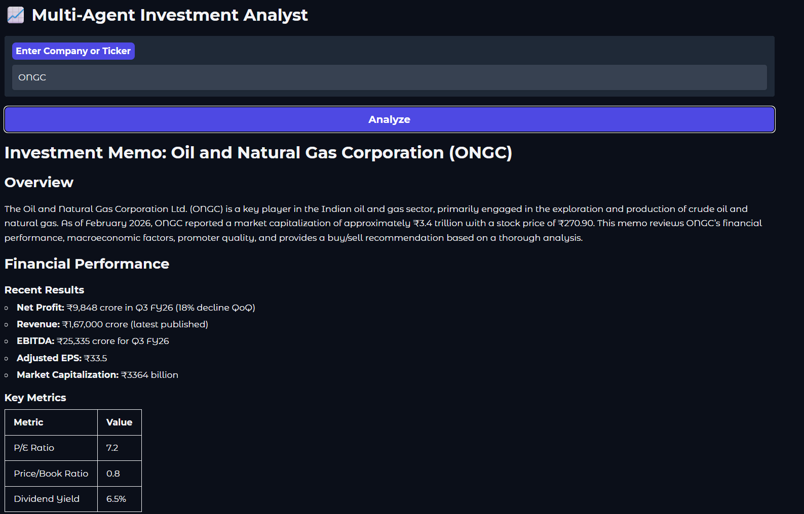
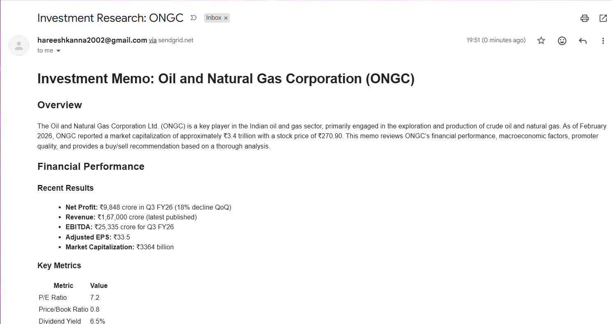
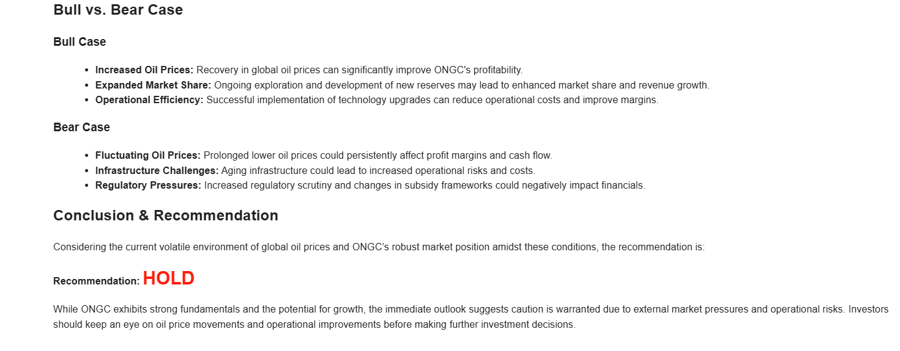
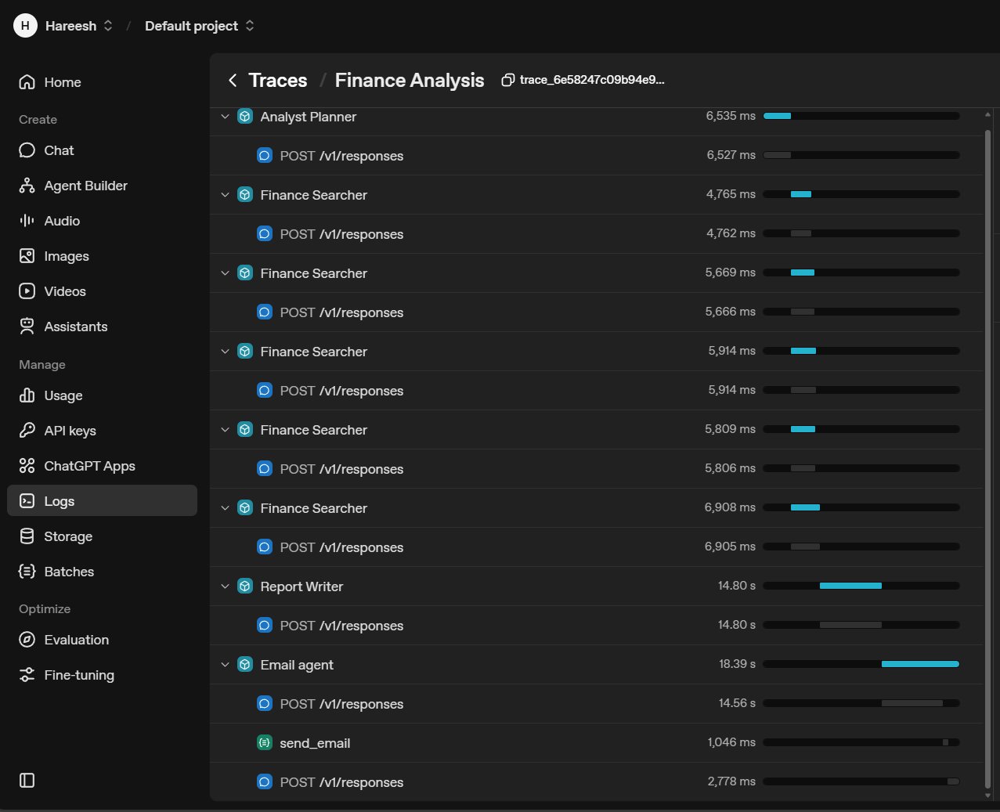

# Investment Analyst: Multi-Agent Orchestrator
*Manual financial research is a bottleneck. Analyzing the Indian Stock Market requires navigating fragmented data across SEBI filings, quarterly earnings transcripts, and sectoral headwinds. This project implements an autonomous Multi-Agent loop that plans, researches, and synthesizes complex financial data into professional investment memos.*

## The Idea
The goal is to move beyond simple RAG (Retrieval-Augmented Generation) and into Autonomous Orchestration. Instead of a single prompt, a Manager delegates specialized tasks to a Planner, a Searcher, and a Writer. This team coordinates to deliver a deep-dive fundamental analysis of any NSE/BSE listed company, complete with Bull/Bear cases and valuation metrics.



## How it Works
The system architecture follows a "Manager-Worker" pattern with four core specialized components:

- **`analyst_planner.py`** — The "Architect." Identifies critical checkpoints for the context (Annual Reports, Concall transcripts, and Peer comparisons).
- **`finance_searcher.py`** — The "Scout." A data-heavy extractor that filters market noise to find Revenue, EBITDA, and Promoter Pledging details.
- **`report_writer.py`** — The "Analyst." Synthesizes raw data into a cohesive 1000+ word Markdown memo with professional formatting.
- **`finance_manager.py`** — The "Orchestrator." Manages the asyncio parallel execution, state transitions, and real-time status yielding to the UI.

## The Loop in Action
The orchestrator manages a live Reasoning Trace. You can observe the agent's progress in real-time as it executes parallel searches across Indian financial platforms like Screener.in, Moneycontrol, and Ticker Tape.

## Design Choices
- **Parallel Intelligence.** Uses asyncio.as_completed to run 5+ web searches simultaneously. The system doesn't wait for one query to finish before starting the next, significantly reducing latency.
- **NSE/BSE Localization.** Specific instruction tuning ensures the agents reason in ₹ (INR) and Lakhs/Crores, focusing on Indian-specific factors like RBI policy impacts and PLI schemes.
- **Verified Deliverability.** Integration with the SendGrid API ensures the final report is not just displayed in the UI, but delivered to your inbox as a formatted HTML document.



## Quick Start
**Requirements:** Python 3.11+, uv, OpenAI API Key, and a SendGrid API Key.

```Bash
# 1. Sync Environment with uv
uv sync

# 2. Setup environment
# Create a .env file with OPENAI_API_KEY and SENDGRID_API_KEY

# 3. Launch the Gradio UI
uv run main.py
```

## Final Output
Once the Report Writer finalizes the thesis, you receive a professional-grade investment memo. The agent ensures the "BUY/HOLD/SELL" recommendation is backed by hard data and institutional-style reasoning.


## Check out traces in OpenAI platform



**Disclaimer:** This is an AI prototype for educational purposes. It does not constitute financial advice. Invest in the Indian market at your own risk.